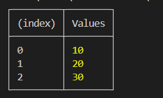
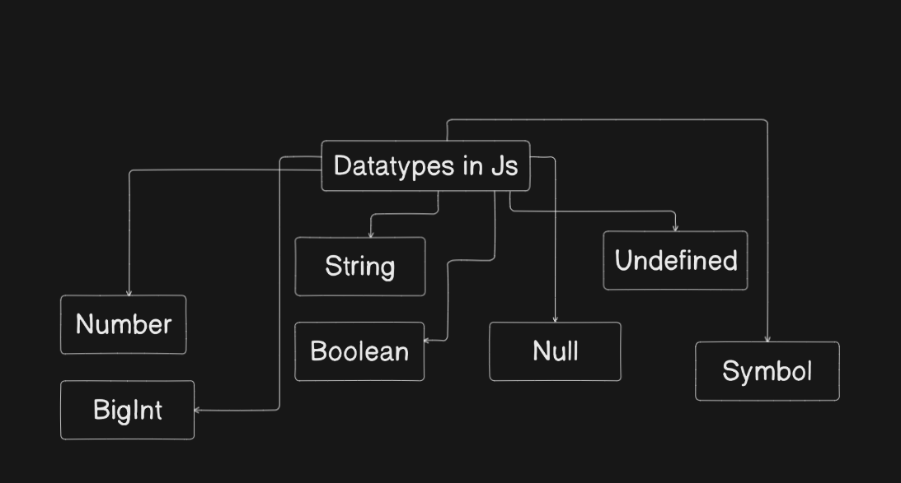
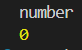

# 01 - Let , Const and Var

## Code
```js
const a = 10;  // cant change its value later
let b = 20;  // can change its value later
var c = 30; // depreciated(dont use its old synatax)

console.table([a,b,c]);  
```

## Output



# 02 - Datatypes and ECMA Standards
## All Datatypes in Js



## Code
```js
"use strict";  // treat all js code as newer version

//alert("hello")  // works in browser not in node 

let a = 10;  // number
let b = 2**53;  // bigInt(anything greater than or equal to 2^53) but typeof operator shows type of bigint as number only
let c = true;  // boolean
let d = "s";  // string
let e = null;  // typeof(null) is object whereas typeof(undefined) is undefined
let f;  // undefined;
// Symbol we will study later in react
```


# 03 - Confusions about type conversion

## 1) String(with only numbers) to Number
```js
let a = "10";
let b = Number(a);
console.log(typeof(b));
console.log(b);
```

## Output


## 2) String(with chars too) to Number
It shows no error and it get converted into a number and when we log it, it shows NaN .
```js
let a = "10abc";
let b = Number(a);
console.log(typeof(b));
console.log(b);
```

## Output


## 3) Null to Number
```js
let a = null;
let b = Number(a);
console.log(typeof(b));
console.log(b);
```

## Output


## 4) Undefined to Number
```js
let a = undefined;
let b = Number(a);
console.log(typeof(b));
console.log(b);
```

## Output


## 5) Boolean to Number
- True converts to 1 and False converts to 0 and vice-versa .
- "" converts to false and "something" converts to true .
```js
let a = true;  // 1 -> true , 0 -> false
let b = Number(a);
console.log(typeof(b));
console.log(b);
```

## Output


# 04 - 

